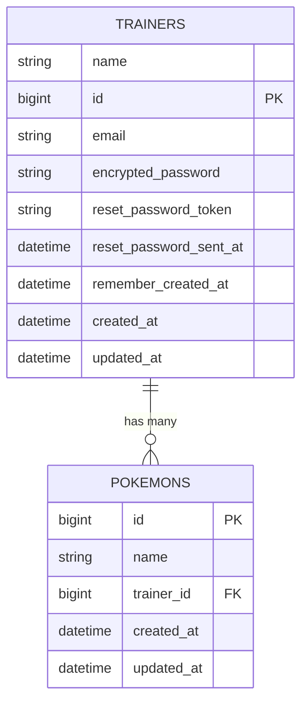

# N+1問題について

「N + 1 問題」について説明してください。<br>
って、企業面接で質問されたら私は嫌です。
なので、勉強しました。
まず、結論から申し上げます。
N + 1問題とはデータベースからデータを取得する際、ループ処理の中でSQLを大量に発行してしまい、パフォーマンスが低下してしまう問題のことです。
解決方法は「includes」メソッドを使って、必要なデータをまとめて取得しましょう。
以上になります。
これだけ覚えて帰ってください。

## どんな時に発生するのか
今回、私は登壇するにあたって、良い題材について探しました。

ずっと悩んでいた結果、N + 1 問題について学ぶことができるゲームがあることに気が付きました。
それは、昔からあるゲームです。


そうですね。ポケットモンスターですね。


今回は、ポケモンに例えて N + 1問題について考えていきます。

N + 1問題は、どのようなケースで発生するのしょうか。
それはテーブルが「１対 多」のアソシエーションの場合に発生します。


例として「ポケモントレーナー」が１に対して、「ポケモン」が多の関係となっているテーブルを用意しました。



トレーナーは、複数のポケモンを所持している。
ポケモンは、１人のトレーナーに属している。という関係です。

ここで、複数のトレーナーのポケモンを全件取得して、一覧表示させてみます。
ポケモンの一覧には、属しているトレーナーの名前も表示します。
このような場合に N + 1 問題が発生します。

## コードを書いてみる。

こんなコードを書いてみました。
```Ruby
pokemons_controller.rb

class PokemonsController < ApplicationController
  def index
    @pokemons = Pokemon.all
  end
end
```

コントローラーのindexアクションです。
Pokemon.all でポケモンを全件取得し、
インスタンス変数 @pokemons に代入します。

ここで発行されるSQLは
```SQL
SELECT "pokemons".* FROM "pokemons"
```
です。

次に、ビューです。

```html
  <% @pokemons.each do |pokemon| %>
      <%= pokemon.name %>
      <%= pokemon.trainer.name %>
  <% end %>
```
インスタンス変数 @pokemons に格納された全ポケモンをeachでまわします。
ここで注目してほしいのは
```
<%= pokemon.trainer.name %>
```
です。
先ほどのER図の通り、Trainersテーブルは、別のテーブルです。
このコードは、別のテーブルの値であるnameカラムを取得しています。
