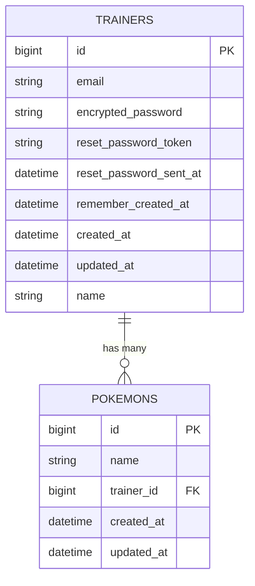

# N+1問題について

「N + 1 問題」について説明してください。 
って、企業面接で質問されたら私は嫌です。
なので、勉強しました。
まず、結論から申し上げます。
N + 1問題とはデータベースからデータを取得する際、ループ処理の中でSQLを大量に発行してしまい、パフォーマンスが低下してしまう問題のことです。
解決方法は「includes」メソッドを使って、必要なデータをまとめて取得しましょう。
以上になります。
これだけ覚えて帰ってください。

## どんな時に発生するのか
「１対多」のアソシエーションの場合に発生します。
